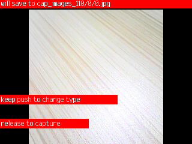

Tool: Capture iamges to SD card (工具： 采集图片到 SD 卡)
=========





Multiple classes supported
多分类支持
---------------

Capture result example(采集结果示例):

```
---cap_images_1
              |
               ----0 (class0)
              |            |
              |             ---0.jpg
              |            |
              |             ---1.jpg
              |            |
              |             ---2.jpg
              |
               ----1 (class1)
              |            |
              |             ---0.jpg
              |            |
              |             ---1.jpg
              |
               ----2 (class2)
---cap_images_2
```


## Usage

1. Change camera and lcd configs according to your hardware like `lcd.rotation`
2. Prepare a `SD` card with `SPI` mode support, and format to `FAT32` with `MBR(msdos)` partition
3. Copy this `boot.py` to your `SD` card root directory
4. Power off board, then insert `SD` card to board
5. Power on, it will automatically create a directory like `cap_images_1`,
    the next time will be `cap_images_2` to avoid rewrite
6. Capture images for one class,
    push `boot` button on board and release to capture one image,
    this will save images as `cap_images_1/0/0.jpg`,
    the name of image will automaitcally increase, like `0.jpg` `1.jpg` ...
7. Long push `boot` botton on board to switch class,
    this will create a new directory like `cap_images_1/1/`,
    and later captured images will be saved to this directory like `cap_images_1/1/0.jpg`
8. Power off board, pop out SD card, mount on your PC, now you get your images in your file brower


## 使用方法

1. 根据你的开发板修改摄像头和屏幕配置， 比如`lcd.rotation`
2. 准备一张支持 `SPI` 模式的 `SD` 卡， 分区为 `MBR （msdos）`， 格式化为 `FAT32`
3. 将目录下的`boot.py`文件拷贝到 `SD` 卡根目录
4. 开发板断电， 将`SD`卡插入开发板
5. 开发板上电， 程序会自动创建一个目录`cap_images_1`, 下次上电会创建`cap_images_2`， 这样就避免了覆盖
6. 采集一个分类的图片
     按开发板上的`boot`按键，然后松开按键来采集一张图片，
     这会将图片保存到`cap_images_1/0/0.jpg`，
     采集的图片的名字会自动增长， 比如`0.jpg` `1.jpg` ...
7. 长按`boot`按键切换类别目录
     这会创建一个新目录，比如`cap_images_1/1/`,
     后面采集的图片都会被保存到这个新的目录， 比如`cap_images_1/1/0.jpg`
8. 开发板断电，取出`SD`卡插到电脑， 打开文件管理器就可以看到采集的图片了


